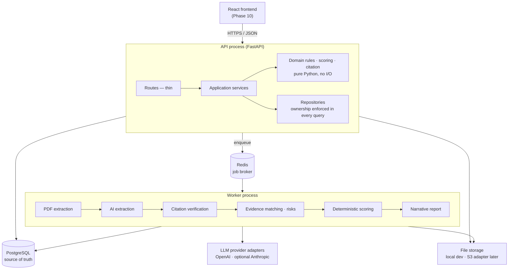

# BidPilot UAE

**Know whether to bid before spending days preparing.**

BidPilot turns an unstructured tender PDF into a reviewable decision workspace. It extracts
requirements with page-level citations, verifies each citation against the source page,
compares requirements against approved company evidence, calculates a transparent
bid-readiness score in Python, and produces a cited advisory recommendation that a human can
override.

Built as a production-minded personal portfolio project: a modular monolith, reliable under
malformed model output, explainable end to end, and operable by one developer.

> AI output is advisory. The readiness score is calculated by explicit Python rules, never by
> a language model, and no finding is treated as canonical without a verified source citation.

---

## Status

Built one roadmap phase at a time (`docs/06_IMPLEMENTATION_ROADMAP.md`). Nothing is claimed
working until its verification commands have been run.

| Phase | Scope | Status |
|---|---|---|
| 0 | Repository foundation, config, logging, error contract, health, migrations, CI | **Complete** |
| 1 | Authentication, refresh rotation, rate limiting, ownership enforcement | **Complete** |
| 2 | Company profile and evidence | Not started |
| 3 | Tender CRUD and PDF upload | Not started |
| 4 | Page-aware extraction | Not started |
| 5 | Background jobs and progress | Not started |
| 6 | Requirement extraction | Not started |
| 7 | Citation verification | Not started |
| 8 | Evidence matching and risks | Not started |
| 9 | Readiness scoring and report | Not started |
| 10 | Frontend | Not started |
| 11 | Evaluation and polish | Not started |
| 12 | Deployment | Not started |

---

## Architecture

A modular monolith with two processes and pragmatic layering. Microservices were rejected
deliberately: one developer, one deployment boundary, and no workload that justifies the
networking and data-consistency cost.



Route handlers contain no business logic and never call a provider. Deterministic scoring and
citation rules are pure functions with no I/O, which is what makes them testable and
repeatable. PostgreSQL — not Redis — holds authoritative job status.

## AI pipeline

The model extracts and explains; application code validates and decides.

```mermaid
flowchart LR
    U["Upload"] --> V["Validate · MIME · size · SHA-256"]
    V --> T["Page-aware text extraction"]
    T --> QA["Page quality assessment"]
    QA --> SEG["Segmentation into batches"]
    SEG --> MD["Tender metadata extraction"]
    MD --> REQ["Requirement extraction<br/>strict schema"]
    REQ --> VAL["Schema validation · normalization"]
    VAL --> CIT{"Citation<br/>verified?"}
    CIT -->|"yes"| CANON["Canonical finding"]
    CIT -->|"no"| RETRY["Retry once with exact page text"]
    RETRY -->|"still unsupported"| REJ["Rejected / uncertain<br/>never canonical"]
    CANON --> MERGE["Duplicate merging"]
    MERGE --> MATCH["Company evidence matching"]
    MATCH --> RISK["Risk extraction"]
    RISK --> SCORE["Deterministic score<br/>Python, versioned"]
    SCORE --> NARR["Narrative from validated records only"]
    NARR --> HR["Human review and override"]
```



Four rules hold throughout:

- Document content is **untrusted evidence, never instructions**. Text inside a tender saying
  "ignore prior instructions" is data to extract, not a command to follow.
- Every material finding carries a source page and exact quote, **verified against the
  extracted page text** before it is persisted as canonical.
- **"Not found" is not proof of absence.** Missing evidence yields `needs_clarification`, not
  a claim that the company lacks a capability.
- A human override **requires a reason** and preserves the original machine result.

---

## Local setup

**Requirements:** Python 3.12+, Docker Desktop, Node 20+ (Phase 10 onward).

```bash
cd backend
py -3.12 -m venv .venv
.venv/Scripts/python -m pip install -e ".[dev]"
cp .env.example .env
docker compose up -d postgres redis
.venv/Scripts/python -m alembic upgrade head
.venv/Scripts/python -m uvicorn app.main:app --reload
```

On Linux or macOS use `python3.12 -m venv .venv` and `.venv/bin/python`.

Compose publishes PostgreSQL on **55432** and Redis on **56379**, not the defaults, so the
stack starts cleanly on a machine already running another project's database. Container
ports stay standard, so nothing inside the compose network is affected. Override with
`POSTGRES_HOST_PORT` / `REDIS_HOST_PORT` in `.env` and update the URLs to match.

Then open:

- <http://localhost:8000/docs> — interactive API documentation
- <http://localhost:8000/health/live> — liveness
- <http://localhost:8000/health/ready> — readiness with dependency detail

### Commands

GNU make is not installed on every machine, so `backend/make.ps1` mirrors every `Makefile`
target for Windows PowerShell. Targets whose phase is not yet built say so and exit non-zero.

| Command | Purpose |
|---|---|
| `make up` / `make down` | Start or stop PostgreSQL and Redis |
| `make migrate` | Apply all migrations |
| `make revision m="add users"` | Autogenerate a migration |
| `make api` | Run the API with autoreload |
| `make lint` / `make format` | Ruff lint and format |
| `make typecheck` | mypy |
| `make test` | Unit and API tests — no external services needed |
| `make test-integration` | Tests requiring PostgreSQL and Redis |
| `make openapi` | Export `backend/artifacts/openapi.json` |
| `make check` | format check + lint + types + unit tests (what CI enforces) |
| `make worker` / `make seed` / `make eval` / `make demo-reset` | Phases 5, 2, 11, 11 |

PowerShell equivalent: `./make.ps1 check`, `./make.ps1 revision -m "add users"`.

### Environment variables

Full annotated list in [backend/.env.example](backend/.env.example). Every value is validated
at startup — a misconfigured process fails immediately with a precise message rather than
serving traffic in an unknown state.

| Variable | Notes |
|---|---|
| `APP_ENV` | `development` \| `test` \| `production`. Docs are disabled in production. |
| `LOG_LEVEL` | JSON logs outside development, readable console inside it. |
| `FRONTEND_ORIGIN` | Comma-separated CORS allowlist. Never a wildcard — refresh cookies need credentials. |
| `DATABASE_URL` | Must use `+asyncpg`; a sync driver is rejected at startup. |
| `REDIS_URL` | Job broker and short-lived progress events. |
| `JWT_SECRET` | Minimum 32 characters. Placeholder values are refused unless `APP_ENV=development`. Also keys the HMAC that hashes client IPs. |
| `ACCESS_TOKEN_MINUTES`, `REFRESH_TOKEN_DAYS` | Token lifetimes. Access tokens are stateless; refresh tokens are revocable. |
| `REFRESH_COOKIE_SECURE`, `REFRESH_COOKIE_SAMESITE` | Leave unset to derive from `APP_ENV`: Lax over http locally, `None` + `Secure` when deployed. |
| `LOGIN_MAX_ATTEMPTS`, `LOGIN_WINDOW_SECONDS` | Fixed-window throttle per account and hashed IP. |
| `UPLOAD_DIR`, `MAX_UPLOAD_BYTES`, `MAX_PDF_PAGES` | Upload bounds; paths are resolved absolute and generated server-side. |
| `OPENAI_API_KEY`, `OPENAI_MODEL` | Required from Phase 6. Never sent to the browser. |
| `PROMPT_VERSION`, `SCORING_VERSION` | Recorded on every analysis so results are reproducible. |

---

## API conventions

Base path `/api/v1`. UUID identifiers, UTC ISO 8601 timestamps, and RFC 7807 problem details
for every error:

```json
{
  "type": "https://bidpilot.dev/problems/service-unavailable",
  "title": "Service dependency unavailable",
  "status": 503,
  "detail": "Not ready: redis unavailable.",
  "instance": "/api/v1/health/ready",
  "code": "SERVICE_DEPENDENCY_UNAVAILABLE",
  "request_id": "9f3ac1d0e4b74e2f8a1b6c5d4e3f2a10"
}
```

`code` is the stable identifier clients switch on; `title` and `detail` are human text that
may be reworded. Tracebacks, database messages, and provider messages are logged, never
returned. Every request carries an `X-Request-ID` — supplied by the client or generated —
echoed on the response and present in every log line for that request.

The full contract is in [docs/04_API_AND_DATA_MODEL.md](docs/04_API_AND_DATA_MODEL.md);
`backend/artifacts/openapi.json` is generated, and the frontend generates its types from it
rather than duplicating interfaces by hand.

## Authentication

A short-lived JWT access token plus a revocable refresh token in an HttpOnly cookie.

```text
POST /api/v1/auth/register    create an account and sign in
POST /api/v1/auth/login       email + password
POST /api/v1/auth/refresh     rotate the refresh cookie, get a new access token
POST /api/v1/auth/logout      revoke the current session
POST /api/v1/auth/logout-all  revoke every session for this user
GET  /api/v1/auth/me          the signed-in user
GET  /api/v1/auth/sessions    where this account is currently signed in
```

The refresh token is **never** returned in a response body — only as an `HttpOnly`, `Secure`,
path-scoped cookie, so no XSS payload can read it. Only its SHA-256 hash is stored.

**Rotation with reuse detection.** Each refresh revokes the presented token and issues a new
one. Presenting an already-revoked token means a replay or a stolen cookie, so every session for
that user is revoked and a fresh sign-in is required. That revocation is committed before the
error response, so it survives the failing request.

**Uniform failures.** A wrong password, an unknown email, and a deactivated account all return
the same 401 and the same message, and an unknown email still spends one dummy Argon2
verification so response timing does not reveal which addresses are registered.

**Throttling.** Fixed-window limits per (account, hashed IP) on login and registration, with
`429` and a `Retry-After` header. Fails open if Redis is unavailable — a cache outage must not
become a login outage.

```bash
curl -s -X POST http://localhost:8000/api/v1/auth/register -H 'Content-Type: application/json' -d '{"email":"coordinator@fm-demo.ae","password":"a-long-demo-passphrase-1","display_name":"Tender Coordinator"}'
```

---

## Testing

```bash
cd backend
./make.ps1 check              # format, lint, types, unit + API tests
docker compose up -d postgres redis
./make.ps1 test-integration   # migrations and real dependency checks
```

Unit and API tests open no sockets and need no database, so the quality gate always runs.
Integration tests use real PostgreSQL and Redis and target a separate `bidpilot_test`
database so they never destroy seeded demo data. Provider behaviour is tested against mocked
responses — CI never depends on paid API calls.

---

## Security

- Secrets only in environment variables; `.env` is git-ignored and only `.env.example` is committed.
- Provider API keys stay server-side and are never exposed to the frontend.
- Passwords hashed with Argon2id, never trimmed, and transparently re-hashed when cost
  parameters change; refresh tokens stored only as SHA-256 hashes and revocable.
- Client IPs recorded as keyed HMACs, never raw, so session history holds no personal data.
- Uploads bounded by extension, MIME sniffing, byte size, page count, and SHA-256; storage
  filenames are generated server-side, so a path-traversal filename cannot influence a path.
- Ownership is enforced inside every repository query, not checked afterwards in another
  layer. Requesting another user's record returns 404 rather than confirming it exists.
- Logs exclude passwords, tokens, keys, full document text, and complete prompts — enforced by
  redaction in the log formatter, not just by convention.
- Uploaded document content is treated as untrusted data and never as instructions.

## Known limitations

- Phases 2–12 are not built yet: no company profile, tenders, uploads, extraction, worker,
  scoring, or frontend.
- No password reset. A forgotten password requires database access; deliberately postponed
  because it needs email delivery that a portfolio demo does not have.
- `request.client.host` is the direct peer, so behind a proxy the recorded IP is the proxy's.
  A deployment needing the true client IP must configure trusted-proxy handling rather than
  trust a spoofable `X-Forwarded-For`.
- Expired refresh sessions are revoked on use but not yet swept on a schedule.
- No OCR: scanned PDFs return a clear unsupported-quality warning rather than silent garbage.
- No virus scanning on uploads — acceptable for a controlled demo, documented as future work.
- Single user, single company profile. Organization tenancy and RBAC are deliberately absent.
- Advisory only. BidPilot does not produce legal conclusions or submit bids.

## Documentation

| Document | Contents |
|---|---|
| [docs/00_START_HERE.md](docs/00_START_HERE.md) | Project framing and build strategy |
| [docs/01_PRODUCT_REQUIREMENTS.md](docs/01_PRODUCT_REQUIREMENTS.md) | Requirements and success criteria |
| [docs/02_BACKEND_ARCHITECTURE.md](docs/02_BACKEND_ARCHITECTURE.md) | Architecture, jobs, errors, security |
| [docs/03_AI_PIPELINE_AND_SCORING.md](docs/03_AI_PIPELINE_AND_SCORING.md) | Pipeline, citations, matching, scoring |
| [docs/04_API_AND_DATA_MODEL.md](docs/04_API_AND_DATA_MODEL.md) | Endpoints and data model |
| [docs/05_FRONTEND_SPEC.md](docs/05_FRONTEND_SPEC.md) | Frontend product and design spec |
| [docs/06_IMPLEMENTATION_ROADMAP.md](docs/06_IMPLEMENTATION_ROADMAP.md) | Phases and exit tests |
| [docs/07_TEST_DEMO_DEPLOYMENT.md](docs/07_TEST_DEMO_DEPLOYMENT.md) | Test strategy, demo script, deployment |
| [docs/08_ENGINEERING_DECISIONS.md](docs/08_ENGINEERING_DECISIONS.md) | Decisions and their reasoning |
