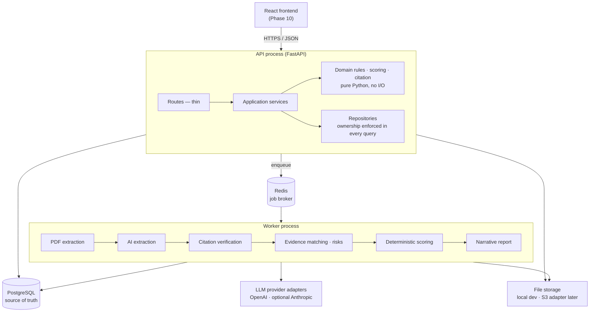

# BidPilot UAE

**Know whether to bid before spending days preparing.**

BidPilot turns an unstructured tender PDF into a reviewable decision workspace. It extracts
requirements with page-level citations, verifies each citation against the source page,
compares requirements against approved company evidence, calculates a transparent
bid-readiness score in Python, and produces a cited advisory recommendation that a human can
override.

Built as a production-minded personal portfolio project: a modular monolith, reliable under
malformed model output, explainable end to end, and operable by one developer.

> AI output is advisory. The readiness score is calculated by explicit Python rules, never by
> a language model, and no finding is treated as canonical without a verified source citation.

---

## Status

Built one roadmap phase at a time (`docs/06_IMPLEMENTATION_ROADMAP.md`). Nothing is claimed
working until its verification commands have been run.

| Phase | Scope | Status |
|---|---|---|
| 0 | Repository foundation, config, logging, error contract, health, migrations, CI | **Complete** |
| 1 | Authentication, refresh rotation, rate limiting, ownership enforcement | **Complete** |
| 2 | Company profile, evidence, and projects; derived expiry; profile completion | **Complete** |
| 3 | Tender CRUD, secure PDF upload, storage adapter, duplicate detection | **Complete** |
| 4 | Page-aware PyMuPDF extraction, page records, quality scoring, unsupported detection | **Complete** |
| 5 | Dramatiq + Redis worker, analysis state machine, progress, retry, idempotency | **Complete** |
| 6 | LLM adapter (OpenAI), structured extraction, versioned prompts, token/cost | **Complete** |
| 7 | Citation verification: exact/normalized/fuzzy matching, rejection of unsupported | **Complete** |
| 8 | Deterministic evidence matching, cited risk extraction, human review | **Complete** |
| 9 | Deterministic readiness scoring, hard blockers, report, human override | **Complete** |
| 10 | Frontend (React 19 / TS / Vite / Tailwind v4): auth, tender desk, command center, company + evidence/project CRUD, export | **Complete** |
| 11 | Gold-set evaluation, demo-reset, Playwright journey, matcher fix | **Complete** |
| 12 | Deployment configuration and docs (Vercel + Render + Neon + Upstash) | **Config ready, not deployed** |

---

## Architecture

A modular monolith with two processes and pragmatic layering. Microservices were rejected
deliberately: one developer, one deployment boundary, and no workload that justifies the
networking and data-consistency cost.



Route handlers contain no business logic and never call a provider. Deterministic scoring and
citation rules are pure functions with no I/O, which is what makes them testable and
repeatable. PostgreSQL — not Redis — holds authoritative job status.

## AI pipeline

The model extracts and explains; application code validates and decides.

```mermaid
flowchart LR
    U["Upload"] --> V["Validate · MIME · size · SHA-256"]
    V --> T["Page-aware text extraction"]
    T --> QA["Page quality assessment"]
    QA --> SEG["Segmentation into batches"]
    SEG --> MD["Tender metadata extraction"]
    MD --> REQ["Requirement extraction<br/>strict schema"]
    REQ --> VAL["Schema validation · normalization"]
    VAL --> CIT{"Citation<br/>verified?"}
    CIT -->|"yes"| CANON["Canonical finding"]
    CIT -->|"no"| RETRY["Retry once with exact page text"]
    RETRY -->|"still unsupported"| REJ["Rejected / uncertain<br/>never canonical"]
    CANON --> MERGE["Duplicate merging"]
    MERGE --> MATCH["Company evidence matching"]
    MATCH --> RISK["Risk extraction"]
    RISK --> SCORE["Deterministic score<br/>Python, versioned"]
    SCORE --> NARR["Narrative from validated records only"]
    NARR --> HR["Human review and override"]
```



Four rules hold throughout:

- Document content is **untrusted evidence, never instructions**. Text inside a tender saying
  "ignore prior instructions" is data to extract, not a command to follow.
- Every material finding carries a source page and exact quote, **verified against the
  extracted page text** before it is persisted as canonical.
- **"Not found" is not proof of absence.** Missing evidence yields `needs_clarification`, not
  a claim that the company lacks a capability.
- A human override **requires a reason** and preserves the original machine result.

---

## Frontend

```bash
cd frontend
npm install
npm run gen:api      # regenerate types from backend/artifacts/openapi.json
npm run dev          # http://localhost:5173 (proxies /api to the backend)
```

React 19 + TypeScript (strict) + Vite + Tailwind v4, typed against the generated OpenAPI schema.
Access tokens live in memory with silent refresh via the HttpOnly cookie. Run the backend API
and worker alongside it. See `docs/05_FRONTEND_SPEC.md` for the design system.

## Local setup

**Requirements:** Python 3.12+, Docker Desktop, Node 20+ (Phase 10 onward).

```bash
cd backend
py -3.12 -m venv .venv
.venv/Scripts/python -m pip install -e ".[dev]"
cp .env.example .env
docker compose up -d postgres redis
.venv/Scripts/python -m alembic upgrade head
.venv/Scripts/python -m uvicorn app.main:app --reload
```

On Linux or macOS use `python3.12 -m venv .venv` and `.venv/bin/python`.

Compose publishes PostgreSQL on **55432** and Redis on **56379**, not the defaults, so the
stack starts cleanly on a machine already running another project's database. Container
ports stay standard, so nothing inside the compose network is affected. Override with
`POSTGRES_HOST_PORT` / `REDIS_HOST_PORT` in `.env` and update the URLs to match.

Then open:

- <http://localhost:8000/docs> — interactive API documentation
- <http://localhost:8000/health/live> — liveness
- <http://localhost:8000/health/ready> — readiness with dependency detail

### Commands

GNU make is not installed on every machine, so `backend/make.ps1` mirrors every `Makefile`
target for Windows PowerShell. Targets whose phase is not yet built say so and exit non-zero.

| Command | Purpose |
|---|---|
| `make up` / `make down` | Start or stop PostgreSQL and Redis |
| `make migrate` | Apply all migrations |
| `make revision m="add users"` | Autogenerate a migration |
| `make api` | Run the API with autoreload |
| `make lint` / `make format` | Ruff lint and format |
| `make typecheck` | mypy |
| `make test` | Unit and API tests — no external services needed |
| `make test-integration` | Tests requiring PostgreSQL and Redis |
| `make openapi` | Export `backend/artifacts/openapi.json` |
| `make check` | format check + lint + types + unit tests (what CI enforces) |
| `make worker` / `make seed` / `make eval` / `make demo-reset` | Phases 5, 2, 11, 11 |

PowerShell equivalent: `./make.ps1 check`, `./make.ps1 revision -m "add users"`.

### Environment variables

Full annotated list in [backend/.env.example](backend/.env.example). Every value is validated
at startup — a misconfigured process fails immediately with a precise message rather than
serving traffic in an unknown state.

| Variable | Notes |
|---|---|
| `APP_ENV` | `development` \| `test` \| `production`. Docs are disabled in production. |
| `LOG_LEVEL` | JSON logs outside development, readable console inside it. |
| `FRONTEND_ORIGIN` | Comma-separated CORS allowlist. Never a wildcard — refresh cookies need credentials. |
| `DATABASE_URL` | Must use `+asyncpg`; a sync driver is rejected at startup. |
| `REDIS_URL` | Job broker and short-lived progress events. |
| `JWT_SECRET` | Minimum 32 characters. Placeholder values are refused unless `APP_ENV=development`. Also keys the HMAC that hashes client IPs. |
| `ACCESS_TOKEN_MINUTES`, `REFRESH_TOKEN_DAYS` | Token lifetimes. Access tokens are stateless; refresh tokens are revocable. |
| `REFRESH_COOKIE_SECURE`, `REFRESH_COOKIE_SAMESITE` | Leave unset to derive from `APP_ENV`: Lax over http locally, `None` + `Secure` when deployed. |
| `LOGIN_MAX_ATTEMPTS`, `LOGIN_WINDOW_SECONDS` | Fixed-window throttle per account and hashed IP. |
| `UPLOAD_DIR`, `MAX_UPLOAD_BYTES`, `MAX_PDF_PAGES` | Upload bounds; paths are resolved absolute and generated server-side. |
| `EVIDENCE_EXPIRING_SOON_DAYS` | "Expiring soon" window, default 60. The state itself is always derived. |
| `OPENAI_API_KEY`, `OPENAI_MODEL` | Required from Phase 6. Never sent to the browser. |
| `PROMPT_VERSION`, `SCORING_VERSION` | Recorded on every analysis so results are reproducible. |

---

## API conventions

Base path `/api/v1`. UUID identifiers, UTC ISO 8601 timestamps, and RFC 7807 problem details
for every error:

```json
{
  "type": "https://bidpilot.dev/problems/service-unavailable",
  "title": "Service dependency unavailable",
  "status": 503,
  "detail": "Not ready: redis unavailable.",
  "instance": "/api/v1/health/ready",
  "code": "SERVICE_DEPENDENCY_UNAVAILABLE",
  "request_id": "9f3ac1d0e4b74e2f8a1b6c5d4e3f2a10"
}
```

`code` is the stable identifier clients switch on; `title` and `detail` are human text that
may be reworded. Tracebacks, database messages, and provider messages are logged, never
returned. Every request carries an `X-Request-ID` — supplied by the client or generated —
echoed on the response and present in every log line for that request.

The full contract is in [docs/04_API_AND_DATA_MODEL.md](docs/04_API_AND_DATA_MODEL.md);
`backend/artifacts/openapi.json` is generated, and the frontend generates its types from it
rather than duplicating interfaces by hand.

## Authentication

A short-lived JWT access token plus a revocable refresh token in an HttpOnly cookie.

```text
POST /api/v1/auth/register    create an account and sign in
POST /api/v1/auth/login       email + password
POST /api/v1/auth/refresh     rotate the refresh cookie, get a new access token
POST /api/v1/auth/logout      revoke the current session
POST /api/v1/auth/logout-all  revoke every session for this user
GET  /api/v1/auth/me          the signed-in user
GET  /api/v1/auth/sessions    where this account is currently signed in
```

The refresh token is **never** returned in a response body — only as an `HttpOnly`, `Secure`,
path-scoped cookie, so no XSS payload can read it. Only its SHA-256 hash is stored.

**Rotation with reuse detection.** Each refresh revokes the presented token and issues a new
one. Presenting an already-revoked token means a replay or a stolen cookie, so every session for
that user is revoked and a fresh sign-in is required. That revocation is committed before the
error response, so it survives the failing request.

**Uniform failures.** A wrong password, an unknown email, and a deactivated account all return
the same 401 and the same message, and an unknown email still spends one dummy Argon2
verification so response timing does not reveal which addresses are registered.

**Throttling.** Fixed-window limits per (account, hashed IP) on login and registration, with
`429` and a `Retry-After` header. Fails open if Redis is unavailable — a cache outage must not
become a login outage.

```bash
curl -s -X POST http://localhost:8000/api/v1/auth/register -H 'Content-Type: application/json' -d '{"email":"coordinator@fm-demo.ae","password":"a-long-demo-passphrase-1","display_name":"Tender Coordinator"}'
```

## Company knowledge base

The record that tender requirements are evaluated against from Phase 8 onward.

```text
POST   /api/v1/company                        create the profile (one per account)
GET    /api/v1/company                        read it, with a fresh completion breakdown
PATCH  /api/v1/company                        partial update
DELETE /api/v1/company                        delete it, cascading to evidence and projects

GET    /api/v1/company/evidence               filter + paginate
POST   /api/v1/company/evidence
GET    /api/v1/company/evidence/{id}
PATCH  /api/v1/company/evidence/{id}
DELETE /api/v1/company/evidence/{id}

GET    /api/v1/company/projects               filter + paginate
POST   /api/v1/company/projects
GET    /api/v1/company/projects/{id}
PATCH  /api/v1/company/projects/{id}
DELETE /api/v1/company/projects/{id}
```

Routes nest under `/company` to match `docs/04_API_AND_DATA_MODEL.md` §3; the profile is a
singleton per account, and evidence and projects belong to it.

**One profile per account** is a database unique constraint on `owner_user_id`, so a concurrent
double-POST cannot create two. **Evidence and projects carry a composite foreign key** on
`(company_profile_id, owner_user_id)`, which makes attaching a record to another user's profile
unrepresentable rather than merely rejected. The profile ID is never read from a request body.

**Projects are a separate entity**, not an evidence subtype: Phase 8 must answer "three similar
projects above AED 2M in Dubai", which needs typed and indexed columns for value, dates,
location, and services delivered.

**Derived expiry state** is calculated on every read and never stored, because "expiring soon"
goes stale with the passage of time alone:

| State | Meaning |
|---|---|
| `expired` | Expiry date in the past — true regardless of verification |
| `unverified` | Not user-verified (or rejected), so its dates are not relied on |
| `no_expiry` | Verified with no expiry date |
| `expiring_soon` | Verified and within `EVIDENCE_EXPIRING_SOON_DAYS` (default 60) |
| `active` | Verified and comfortably in date |

Precedence runs top to bottom. The same rules exist twice — once in Python for a loaded record,
once as SQL predicates for filtering — and an integration test asserts the two agree across a
full matrix of dates and statuses, so a list and a detail view can never disagree.

**Profile completion** is deterministic Python in a versioned module, never the frontend and
never a model. Weights total exactly 100, so the bound is arithmetic rather than clamping:
78 for the required core (text fields must be substantive — a one-word description earns
nothing), 10 for list depth, 12 for the optional commercial fields. The response includes the
full component breakdown and a `missing` list ordered heaviest-first, so the UI can explain the
number instead of just displaying it.

Filter evidence by `category`, `verification_status`, `expiry_state`, `search`, and `tag`;
projects by `status`, `search`, and `service`. Both use offset pagination with a total count.

## Tenders and documents

```text
GET/POST      /api/v1/tenders                     list (status/search/deadline filters) · create
GET/PATCH/DELETE /api/v1/tenders/{id}             delete removes documents and their files
POST          /api/v1/tenders/{id}/documents      multipart PDF upload
GET           /api/v1/tenders/{id}/documents
GET/DELETE    /api/v1/documents/{id}
```

Uploads are accepted by **content, not name**: the leading bytes must be `%PDF-`, size is
bounded by `MAX_UPLOAD_BYTES`, and the SHA-256 is recorded. An identical file on the same
tender returns 409; the client's filename is sanitized for display only, and storage paths are
always server-generated (`{user_id}/{tender_id}/{uuid}.pdf`).

On upload the PDF is parsed page-by-page with PyMuPDF (page numbers preserved 1-based, raw and
normalized text stored, per-page quality scored). A document with too little text — a scanned
PDF — is recorded as `unsupported` rather than transcribed; there is no OCR. Pages are then
retrievable, which is what the source viewer and citation verification build on:

```text
GET /api/v1/documents/{id}/pages              per-page metadata (numbers, sizes, quality)
GET /api/v1/documents/{id}/pages/{number}     one page's extracted text
```

## Analysis jobs

Analysis runs in a background worker so the API stays responsive. PostgreSQL — not Redis — is
the authoritative record of job state; Redis only carries the Dramatiq message.

```text
POST /api/v1/tenders/{id}/analyses     queue a run (202 Accepted)
GET  /api/v1/analyses/{id}             full record with provenance and cost
GET  /api/v1/analyses/{id}/events      poll status + stage (every 2-3s; no fake percentage)
POST /api/v1/analyses/{id}/retry       re-queue a failed run
```

Run the worker alongside the API:

```bash
make worker      # or: ./make.ps1 worker  (dramatiq app.workers.main)
```

The pipeline is an ordered list of stage handlers; each roadmap phase from 6 onward inserts its
stage (metadata, requirements, citations, matching, risks, scoring, report) before completion.
Every stage transition is committed, so status always reflects real progress.

### Demo data

```bash
python scripts/seed_demo.py
```

Loads one fictional Dubai facilities-management company — trade licence, ISO 9001, two insurance
policies, financial statements, staff CVs, equipment, an ISO 14001 gap recorded as unverified,
and two projects — through the same services the API uses, so seeded rows obey every validator.
Dates are stored as offsets from today, so the insurance policy always lands in `expiring_soon`
whenever the demo runs. Nothing in it is real: no actual company, person, licence number, or
contact detail. `--reset` removes it.

---

## Testing

```bash
cd backend
./make.ps1 check              # format, lint, types, unit + API tests
docker compose up -d postgres redis
./make.ps1 test-integration   # migrations and real dependency checks
```

Unit and API tests open no sockets and need no database, so the quality gate always runs.
Integration tests use real PostgreSQL and Redis and target a separate `bidpilot_test`
database so they never destroy seeded demo data. Provider behaviour is tested against mocked
responses — CI never depends on paid API calls.

---

## Security

- Secrets only in environment variables; `.env` is git-ignored and only `.env.example` is committed.
- Provider API keys stay server-side and are never exposed to the frontend.
- Passwords hashed with Argon2id, never trimmed, and transparently re-hashed when cost
  parameters change; refresh tokens stored only as SHA-256 hashes and revocable.
- Client IPs recorded as keyed HMACs, never raw, so session history holds no personal data.
- Uploads bounded by extension, MIME sniffing, byte size, page count, and SHA-256; storage
  filenames are generated server-side, so a path-traversal filename cannot influence a path.
- Ownership is enforced inside every repository query, not checked afterwards in another
  layer. Requesting another user's record returns 404 rather than confirming it exists.
- Logs exclude passwords, tokens, keys, full document text, and complete prompts — enforced by
  redaction in the log formatter, not just by convention.
- Uploaded document content is treated as untrusted data and never as instructions.

## Deployment

Configuration and a full manual guide live in **[deploy/DEPLOYMENT.md](deploy/DEPLOYMENT.md)** — a
completely free student deployment: Vercel Hobby (frontend) + **one** Render Free Web Service that
runs the API and the Dramatiq worker in the same container ([`backend/scripts/start.sh`](backend/scripts/start.sh))
+ Supabase (PostgreSQL and private S3 Storage) + Upstash (Redis). The blueprint is
[`render.yaml`](render.yaml) (single free service, no paid worker); the frontend config is
[`frontend/vercel.json`](frontend/vercel.json); production env template is
[`backend/.env.production.example`](backend/.env.production.example). The guide covers the
architecture diagram, Supabase/Upstash/Vercel setup, environment and secret handling, migration and
start commands, health checks, rollback, data reset, a ~$0/month cost estimate, free-tier
limitations, and a production-readiness disclaimer. **Nothing there provisions paid infrastructure
automatically.** Set `STORAGE_BACKEND=local` for development (the default) or `s3` for deployment.

### Demo checklist

1. `make up` (Postgres + Redis), then in the backend venv `make migrate` and `make seed`.
2. Start `make api` and `make worker`; start the frontend with `npm run dev`.
3. Sign in as `demo@fm-demo.ae` / `bidpilot-demo-passphrase-1`.
4. Company workspace: profile, evidence with live expiry, projects; open and close the edit modal.
5. Upload `backend/sample_data/sample_tender.pdf`, run an analysis, watch the stages, open a
   citation in the source drawer, submit a readiness override with a reason.
6. Export the requirements CSV / full-analysis JSON.
7. `make demo-reset` returns everything to the seeded starting state.

## Known limitations

- No file upload on evidence. The response carries a contract-stable `attachment: null`, but no
  storage columns exist — adding them in Phase 3 is additive, so inventing them now would be
  speculation.
- Extending a controlled vocabulary (evidence category, emirate, project status) needs a small
  migration, because each is also a database check constraint. Deliberate: a typo'd category
  would silently hide evidence from every filter.
- `profile_completion_percentage` is persisted for future sorting but reads always serve a
  freshly calculated score, so a stored value left stale by an algorithm change is never
  returned. A backfill command is future work.
- No password reset. A forgotten password requires database access; deliberately postponed
  because it needs email delivery that a portfolio demo does not have.
- `request.client.host` is the direct peer, so behind a proxy the recorded IP is the proxy's.
  A deployment needing the true client IP must configure trusted-proxy handling rather than
  trust a spoofable `X-Forwarded-For`.
- Expired refresh sessions are revoked on use but not yet swept on a schedule.
- No OCR: scanned PDFs return a clear unsupported-quality warning rather than silent garbage.
- No virus scanning on uploads — acceptable for a controlled demo, documented as future work.
- Single user, single company profile. Organization tenancy and RBAC are deliberately absent.
- Advisory only. BidPilot does not produce legal conclusions or submit bids.

## Documentation

| Document | Contents |
|---|---|
| [docs/00_START_HERE.md](docs/00_START_HERE.md) | Project framing and build strategy |
| [docs/01_PRODUCT_REQUIREMENTS.md](docs/01_PRODUCT_REQUIREMENTS.md) | Requirements and success criteria |
| [docs/02_BACKEND_ARCHITECTURE.md](docs/02_BACKEND_ARCHITECTURE.md) | Architecture, jobs, errors, security |
| [docs/03_AI_PIPELINE_AND_SCORING.md](docs/03_AI_PIPELINE_AND_SCORING.md) | Pipeline, citations, matching, scoring |
| [docs/04_API_AND_DATA_MODEL.md](docs/04_API_AND_DATA_MODEL.md) | Endpoints and data model |
| [docs/05_FRONTEND_SPEC.md](docs/05_FRONTEND_SPEC.md) | Frontend product and design spec |
| [docs/06_IMPLEMENTATION_ROADMAP.md](docs/06_IMPLEMENTATION_ROADMAP.md) | Phases and exit tests |
| [docs/07_TEST_DEMO_DEPLOYMENT.md](docs/07_TEST_DEMO_DEPLOYMENT.md) | Test strategy, demo script, deployment |
| [docs/08_ENGINEERING_DECISIONS.md](docs/08_ENGINEERING_DECISIONS.md) | Decisions and their reasoning |
