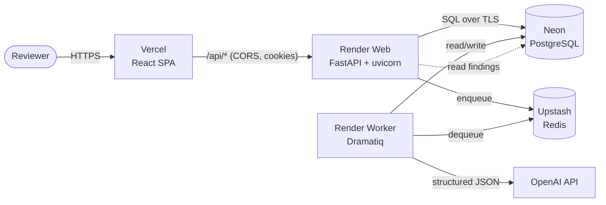

# BidPilot UAE — Deployment Guide

A lightweight, free-tier deployment for a personal portfolio demo. **Nothing here provisions paid
infrastructure automatically** — you create the accounts and click deploy. This document is
configuration and instructions only.

> **Production-readiness disclaimer.** BidPilot is a portfolio project, not a production service.
> It targets free tiers with cold starts, ephemeral disks, and no horizontal scaling, backups, or
> uptime guarantees. Do not use it with real, confidential, or regulated tender data. The demo
> data is entirely fictional.

---

## Architecture



- **Frontend** (Vercel): static Vite build. Calls the backend cross-site at `VITE_API_BASE`.
- **Web** (Render): FastAPI behind uvicorn with `--proxy-headers`. Serves the API and health checks.
- **Worker** (Render): the Dramatiq consumer that runs the analysis pipeline.
- **PostgreSQL** (Neon) and **Redis** (Upstash): external managed datastores, free tier, TLS.
- **OpenAI**: called only by the worker, for schema-constrained extraction. Scoring stays in Python.

---

## Prerequisites

Accounts (all have free tiers): GitHub, Vercel, Render, Neon, Upstash, OpenAI. No CLI is required;
everything below is dashboard-driven.

---

## Manual deployment

### 1. PostgreSQL (Neon)

1. Create a project; copy the connection string.
2. Rewrite the scheme for the async driver and keep TLS:
   `postgresql://…` → `postgresql+asyncpg://…?ssl=require`
3. Save it as `DATABASE_URL` (used by both Render services).

### 2. Redis (Upstash)

1. Create a Redis database (region close to Render).
2. Copy the **TLS** URL (`rediss://…`). Save it as `REDIS_URL`.

### 3. Backend + worker (Render)

Either apply the blueprint or create the two services by hand.

**Blueprint:** in Render, *New → Blueprint*, point at this repo. It reads [`render.yaml`](../render.yaml)
and creates `bidpilot-api` (web) and `bidpilot-worker`. Then set the `sync:false` secrets
(`DATABASE_URL`, `REDIS_URL`, `JWT_SECRET`, `OPENAI_API_KEY`, `FRONTEND_ORIGIN`) in each service.

**By hand** (root directory `backend/`, Python 3.12, `pip install -e .`):

| Service | Start command |
|---|---|
| Web | `python -m uvicorn app.main:app --host 0.0.0.0 --port $PORT --proxy-headers --forwarded-allow-ips="*"` |
| Worker | `python -m dramatiq app.workers.main` |
| Migration (web pre-deploy) | `python -m alembic upgrade head` |

Set env vars from [`backend/.env.production.example`](../backend/.env.production.example). Health
check path: `/health/ready`.

### 4. Seed the demo

From a one-off Render shell on the web service (or locally against the Neon URL):

```bash
python scripts/seed_demo.py
```

### 5. Frontend (Vercel)

1. *New Project* → import the repo → root directory `frontend/`. Vercel detects Vite and reads
   [`frontend/vercel.json`](../frontend/vercel.json) (build `npm run build`, output `dist`, SPA rewrite).
2. Add env var `VITE_API_BASE` = your Render web URL (e.g. `https://bidpilot-api.onrender.com`).
3. Deploy, then set the backend's `FRONTEND_ORIGIN` to the resulting Vercel URL and redeploy the
   web service so CORS and the cross-site refresh cookie line up.

### 6. Smoke test

Open the Vercel URL, sign in with the demo credentials, open the company workspace, upload the
sample tender (`backend/sample_data/sample_tender.pdf`), run an analysis, and open a citation.

---

## Environment variables

Full reference: [`backend/.env.production.example`](../backend/.env.production.example). The ones
that must differ from development:

| Variable | Production value | Why |
|---|---|---|
| `APP_ENV` | `production` | disables `/docs`, enforces real secrets, Secure cookies |
| `FRONTEND_ORIGIN` | the Vercel URL | exact CORS allowlist (never `*` with cookies) |
| `DATABASE_URL` | Neon, `postgresql+asyncpg://…?ssl=require` | async driver + TLS |
| `REDIS_URL` | Upstash `rediss://…` | TLS broker for Dramatiq |
| `JWT_SECRET` | 48+ random chars | token signing |
| `REFRESH_COOKIE_SAMESITE` / `_SECURE` | `none` / `true` | cross-site cookie between vercel.app and onrender.com |
| `VITE_API_BASE` (Vercel) | Render web URL | frontend → backend origin |
| `OPENAI_API_KEY` | your key | worker-only; keep spend controlled |

## Secret handling

- Secrets live only in each host's dashboard (Render env vars marked secret, Vercel env vars,
  Neon/Upstash connection strings). Never in the repo — `.env` is git-ignored; only `*.example`
  templates are committed.
- `render.yaml` marks every secret `sync:false`, so Blueprint apply never bakes a value into git.
- Rotate `JWT_SECRET` to invalidate all sessions. Rotate the OpenAI key from the OpenAI dashboard.
- The frontend never receives provider keys, the DB URL, or the refresh secret — only `VITE_API_BASE`.

## Health checks

- `GET /health/live` — process is up (no dependency checks). Use for liveness.
- `GET /health/ready` — checks PostgreSQL and Redis; returns 503 `application/problem+json` naming
  the failed dependency. Render's health check path.

## Migrations

`python -m alembic upgrade head` — runs as the web service **pre-deploy** command, so schema is
migrated once per deploy before traffic shifts. Idempotent.

## Rollback

- **Code:** Render → the service → *Deploys* → *Rollback* to the previous successful deploy.
  Vercel → *Deployments* → promote the previous build. Both are near-instant.
- **Schema:** roll back one migration with `python -m alembic downgrade -1` from a one-off shell.
  Because deploys migrate forward automatically, prefer a code rollback to a compatible revision
  over a manual downgrade unless a migration is the specific cause.
- **Order:** roll the frontend and backend back together when an API contract changed.

## Data reset

```bash
python scripts/demo_reset.py     # clears the demo user's tenders/analyses, re-seeds the company
```

Uploaded files live on the ephemeral disk and vanish on redeploy; re-upload the sample after a
reset or a restart.

## Cost estimate

| Component | Tier | Monthly |
|---|---|---|
| Vercel (Hobby) | free | $0 |
| Render web + worker | free | $0 (cold starts; worker may sleep) |
| Neon PostgreSQL | free | $0 |
| Upstash Redis | free | $0 (per-command free allotment) |
| OpenAI | pay-as-you-go | ~$0.05–0.10 per analysis (gpt-4o-mini/gpt-5-mini); a full gold-set run measured $0.35 |

Effectively **$0/month** plus a few cents per analysis you actually run.

## Known limitations

- **Cold starts:** free Render services sleep; the first request after idle takes ~30–60s, and a
  sleeping worker delays analysis pickup.
- **Ephemeral uploads:** local file storage is wiped on redeploy/restart. An S3-compatible backend
  is the documented next step for durable uploads.
- **Single worker, no autoscaling, no backups, no custom domain/CDN tuning.**
- **Demo-scale only:** no multi-tenancy, billing, or SLA. See the disclaimer above.
